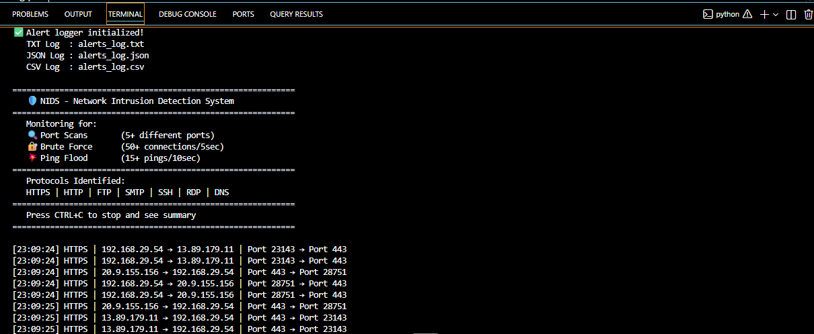
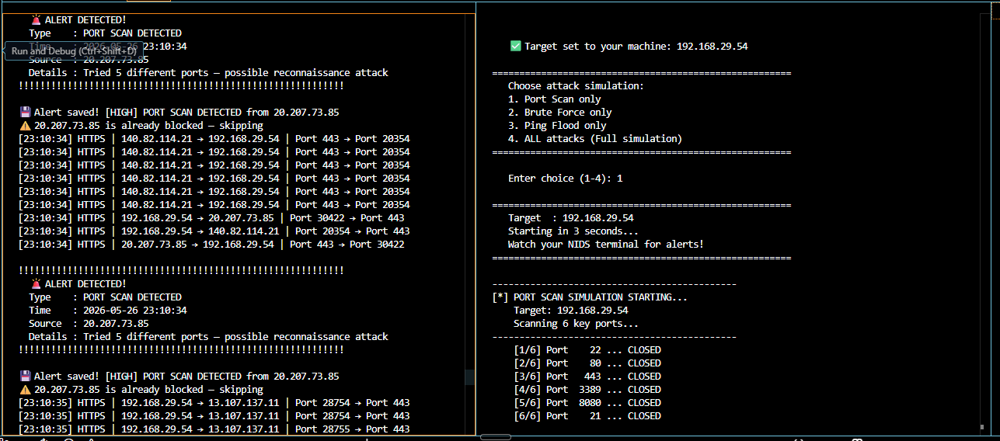
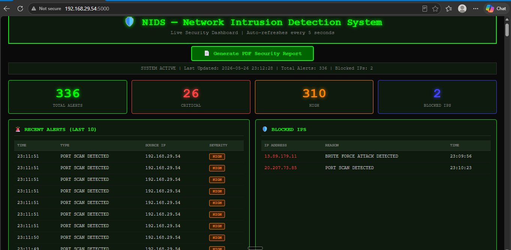
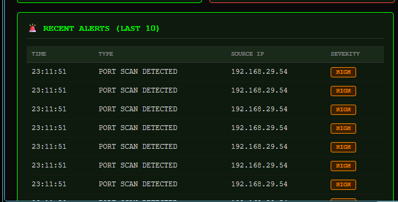
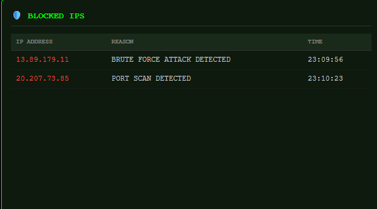
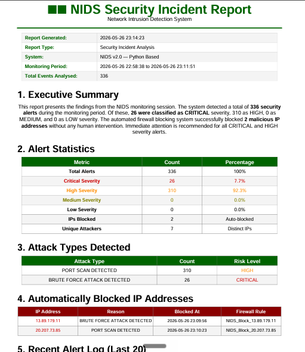
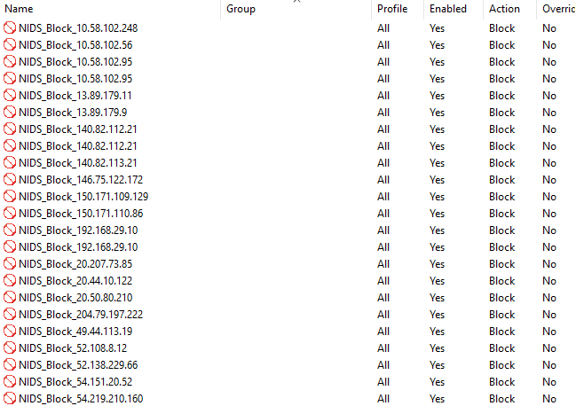
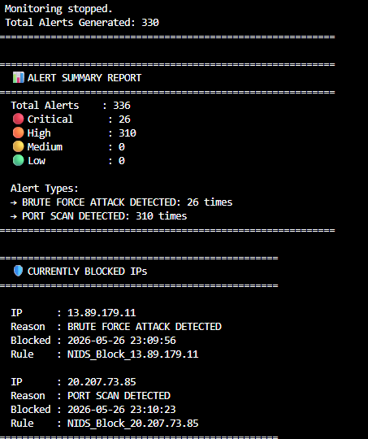

# 🛡️ Network Intrusion Detection System (NIDS)
### with Automated Firewall Blocking


> **A real-time network security monitoring system built in Python that automatically detects network attacks and blocks malicious IP addresses using Windows Firewall — with zero human intervention.**

---

## 📌 What is This Project?

This project is a **Network Intrusion Detection System (NIDS)** — a security tool that:

- 👀 **Watches** every single network packet in real time
- 🧠 **Detects** three types of network attacks automatically
- 🚨 **Alerts** the security analyst with full details
- 🛡️ **Blocks** the attacking IP using Windows Firewall instantly
- 💾 **Logs** all alerts in TXT, JSON, and CSV formats
- 📊 **Shows** everything on a live browser dashboard
- 📄 **Generates** professional PDF security reports

> Built during internship at **Pragyan EduSec LLP, Hubballi** — February to May 2026

---

## 🎯 Problem Statement

Modern networks face constant cyber attacks. Port scanning, brute force attacks, and ping floods are among the most common. The problem is:

- ❌ Human analysts **cannot monitor thousands of packets per second** manually
- ❌ By the time a human detects an attack, **damage is already done**
- ❌ Most open-source NIDS tools are **complex and expensive** to set up

**Our solution:** A lightweight Python NIDS that detects attacks automatically and responds in **under 1 second** with **zero human action required.**

---

## 🚀 Features

| Feature | Description |
|---------|-------------|
| 📡 **Live Packet Capture** | Captures every network packet using Scapy |
| 🔍 **Port Scan Detection** | Detects when any IP probes 5+ unique ports |
| 🔐 **Brute Force Detection** | Detects 30+ rapid connections in 10 seconds |
| 💥 **Ping Flood Detection** | Detects 10+ ICMP pings in 30 seconds |
| 🛡️ **Auto Firewall Blocking** | Blocks attacking IP via Windows netsh command |
| 💾 **Triple Format Logging** | Saves alerts to TXT, JSON, and CSV simultaneously |
| 📊 **Live Dashboard** | Browser dashboard at port 5000, refreshes every 5 sec |
| 📄 **PDF Report Generator** | One-click professional security incident report |
| ⚡ **Attack Simulator** | Test the system with simulated attacks |
| ✅ **Whitelist System** | Prevents blocking of trusted IPs |

---

## 🗂️ Project Structure

```
NIDS_Project/
│
├── threat_detector.py      # Main detection engine
├── alert_logger.py         # Saves alerts to TXT, JSON, CSV
├── firewall_blocker.py     # Auto-blocks IPs via Windows Firewall
├── dashboard.py            # Live Flask web dashboard
├── report_generator.py     # PDF report generator
├── attack_simulator.py     # Simulates attacks for testing
├── packet_capture.py       # Basic packet display module
│
├── alerts_log.txt          # Human-readable log (auto-created)
├── alerts_log.json         # Machine-readable log (auto-created)
├── alerts_log.csv          # Excel-compatible log (auto-created)
├── blocked_ips.json        # Blocked IP records (auto-created)
│
└── README.md
```

---

## 🧠 How Detection Works

```
Network Traffic (all packets)
         ↓
📡 Scapy Packet Sniffer  [threat_detector.py]
         ↓
🧠 Three Detection Algorithms run simultaneously:
   ├── Port Scan    → defaultdict(set)  → 5 unique ports   = HIGH alert
   ├── Brute Force  → defaultdict(list) → 30 in 10 seconds = CRITICAL alert
   └── Ping Flood   → defaultdict(list) → 10 in 30 seconds = MEDIUM alert
         ↓
   Threshold Crossed?  YES
         ↓
🚨 create_alert() called
   ├── 💾 log_alert()   → Save to TXT + JSON + CSV
   └── 🛡️ block_ip()    → Windows Firewall rule added
         ↓
📊 Flask Dashboard reads JSON → updates every 5 seconds
📄 PDF Report generated on demand with one click
```

---

## 📋 Detection Thresholds

| Attack Type | Threshold | Time Window | Severity | Protocol |
|-------------|-----------|-------------|----------|----------|
| Port Scan | 5 unique ports from same IP | Session-wide | 🟠 HIGH | TCP + UDP |
| Brute Force | 30 connections from same IP | 10 seconds | 🔴 CRITICAL | TCP |
| Ping Flood | 10 ICMP pings from same IP | 30 seconds | 🟡 MEDIUM | ICMP |

---

## ⚙️ Installation

### Step 1 — Clone Repository
```bash
git clone https://github.com/shreya293/NIDS-Project/tree/main
cd NIDS-Project
```

### Step 2 — Install Libraries
```bash
pip install scapy flask reportlab
```

### Step 3 — Install Npcap (Windows only)
Download and install from: **https://npcap.com/**
> Required by Scapy for packet capture on Windows.

### Step 4 — Run as Administrator
> ⚠️ **IMPORTANT:** Right-click VS Code → **Run as Administrator**
> Required for both packet capture AND Windows Firewall blocking.

---

## ▶️ How to Run

**Terminal 1 — Start Detection System:**
```bash
python threat_detector.py
```

**Terminal 2 — Start Dashboard:**
```bash
python dashboard.py
```

**Open Browser:**
```
http://127.0.0.1:5000
```

**Terminal 3 — Test with Attack Simulator:**
```bash
python attack_simulator.py
```

Choose attack type:
- `1` → Port Scan simulation
- `2` → Brute Force simulation
- `3` → Ping Flood simulation
- `4` → ALL attacks (full demo)

---

## 🧹 Clean Logs Before Each Session

Run this in PowerShell before starting a fresh session:
```powershell
Remove-Item -Path "alerts_log.txt","alerts_log.json","alerts_log.csv","blocked_ips.json" -ErrorAction SilentlyContinue
```

---

## 📸 Screenshots

---

### 📷 Screenshot 1 — Live Terminal Packet Capture

> This shows threat_detector.py running and capturing every network packet in real time.
> Each line is one packet — you can see HTTPS, DNS, TCP, FTP traffic being monitored.
> The system identifies the protocol automatically from the port number.




---

### 📷 Screenshot 2 — Port Scan Attack Detected

> Left terminal: NIDS showing PORT SCAN DETECTED alert with source IP, timestamp, and details.
> Right terminal: Attack simulator showing the port scan running and completing.
> Both running simultaneously — attacker on right, defender detecting on left.



---

### 📷 Screenshot 3 — Live Dashboard Home View

> Browser dashboard at http://127.0.0.1:5000 showing four statistics cards:
> Total Alerts (green), Critical count (red), High count (orange), Blocked IPs (blue).
> The green blinking dot shows system is actively monitoring.
> Auto-refreshes every 5 seconds automatically.



---

### 📷 Screenshot 4 — Dashboard Recent Alerts Table

> The recent alerts feed showing last 10 alerts in reverse chronological order.
> Each row shows: exact timestamp, attack type, source IP address, and severity badge.
> CRITICAL shown in red, HIGH in orange, MEDIUM in yellow.



---

### 📷 Screenshot 5 — Dashboard Blocked IPs Table

> All IP addresses automatically blocked by Windows Firewall shown here.
> Each entry shows: IP address, reason for blocking, time of blocking, and firewall rule name.
> These rules can be verified in Windows Defender Firewall Advanced Settings → Inbound Rules.



---

### 📷 Screenshot 6 — PDF Security Incident Report

> Professional security report generated with one click from the dashboard.
> Contains: Report metadata, Executive Summary, Alert Statistics, Attack Types,
> Blocked IP Addresses table, and Security Recommendations.
> Generated automatically from collected alert data using ReportLab.



---

### 📷 Screenshot 7 — Windows Firewall Inbound Rules

> Windows Defender Firewall Advanced Settings showing NIDS_Block rules.
> Each rule was created automatically by our Python code using netsh command.
> This proves the firewall blocking actually works — not just logged but enforced!



---

### 📷 Screenshot 8 — Alert Summary Report

> Complete session summary printed after pressing Ctrl+C to stop monitoring.
> Shows total alerts, breakdown by severity (Critical/High/Medium/Low),
> alert types with counts, and all currently blocked IPs with firewall rule names.
> This is the complete proof that the entire system worked end-to-end.



---

## 🔓 Unblocking an IP

If a legitimate IP was wrongly blocked:

**Option 1 — Python function:**
```python
python
from firewall_blocker import unblock_ip
unblock_ip("192.168.1.100")
```

**Option 2 — Windows Firewall GUI:**
```
Windows Key → Windows Defender Firewall →
Advanced Settings → Inbound Rules →
Find NIDS_Block_[IP] → Right-click → Delete
```

**Option 3 — Command line:**
```
netsh advfirewall firewall delete rule name=NIDS_Block_192.168.1.100
```

---

## 🛡️ Whitelist System

These IPs are permanently whitelisted and will NEVER be blocked:
- `127.0.0.1` — Localhost
- `192.168.x.1` — Your router/gateway
- Your own IP address
- `8.8.8.8`, `8.8.4.4` — Google DNS
- Microsoft Azure server ranges (OneDrive, Teams, Update)

**Add your own trusted IP to whitelist in firewall_blocker.py:**
```python
WHITELIST = [
    "127.0.0.1",
    "192.168.29.1",
    "YOUR_TRUSTED_IP",    # Add here
]
```

---

## ❓ Troubleshooting

| Problem | Solution |
|---------|----------|
| IPs not being blocked | Run VS Code as Administrator |
| del command gives error | Use `Remove-Item` with `-ErrorAction SilentlyContinue` |
| Scapy cannot capture packets | Install Npcap from https://npcap.com/ |
| Too many false positives | Raise PORT_SCAN_THRESHOLD to 15 or 20 |
| Dashboard not loading | Make sure dashboard.py is running in separate terminal |
| Port scan not detected | Delete old log files and restart fresh session |

---

## 🎯 Attack Types Explained

### 🔍 Port Scan
An attacker probes multiple ports to find open services.
Like a thief trying every door of a building to find an unlocked one.
**Detection:** Any IP trying 5+ unique ports → HIGH severity alert.

### 🔐 Brute Force
Rapid repeated connection attempts to guess passwords.
Like trying 100 different keys on a lock very fast — only a machine can do this.
**Detection:** 30+ connections from same IP in 10 seconds → CRITICAL severity alert.

### 💥 Ping Flood (DoS)
Flooding target with ICMP pings to overwhelm and crash it.
Like ringing a doorbell 100 times per second to disturb the residents.
**Detection:** 10+ pings from same IP in 30 seconds → MEDIUM severity alert.

---

## 🛠️ Technologies Used

| Technology | Version | Purpose |
|------------|---------|---------|
| Python | 3.x | Primary development language |
| Scapy | 2.5+ | Live packet capture and ICMP crafting |
| Flask | 3.x | Live web dashboard server |
| ReportLab | 4.x | PDF report generation |
| Npcap | 1.x | Windows packet capture driver |
| Windows Firewall (netsh) | Built-in | Automated IP blocking |

---

## 👩‍💻 Author

**Shreya Singh Chauhan**
- USN: 3PD22CS102
- 8th Semester, B.E. Computer Science and Engineering
- PDA College of Engineering, Kalaburagi
- Internship: Pragyan EduSec LLP, Hubballi (Feb–May 2026)

---

## 📜 License

```
MIT License
Free to use, modify, and distribute with attribution.
```

---

## ⚠️ Disclaimer

> This tool is for **educational purposes and authorised testing only.**
> Only use on networks you **own or have explicit permission** to monitor.
> Unauthorised scanning is **illegal** under IT Act 2000 (India).

---

## 🙏 Acknowledgements

- [Scapy](https://scapy.readthedocs.io/) — Packet capture library
- [Flask](https://flask.palletsprojects.com/) — Web framework
- [ReportLab](https://www.reportlab.com/) — PDF generation
- [Npcap](https://npcap.com/) — Windows packet capture driver
- Pragyan EduSec LLP — Internship guidance and support

---

*"I built a working security system — not just a theory project."*

⭐ **Star this repository if it helped you!**
